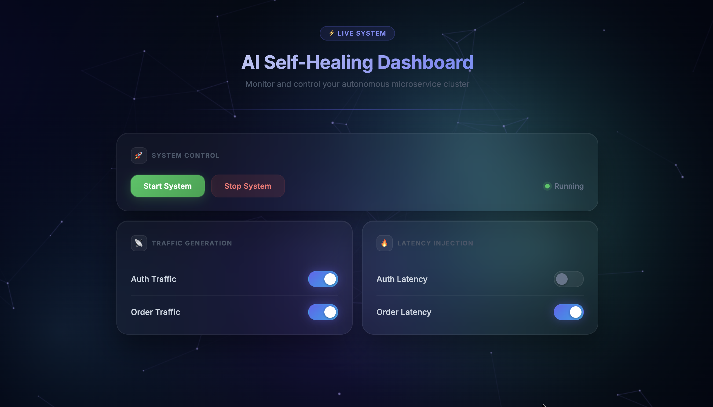
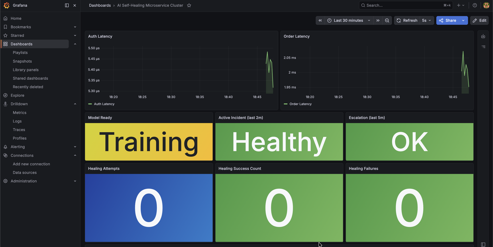
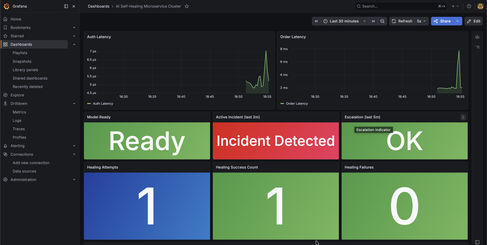
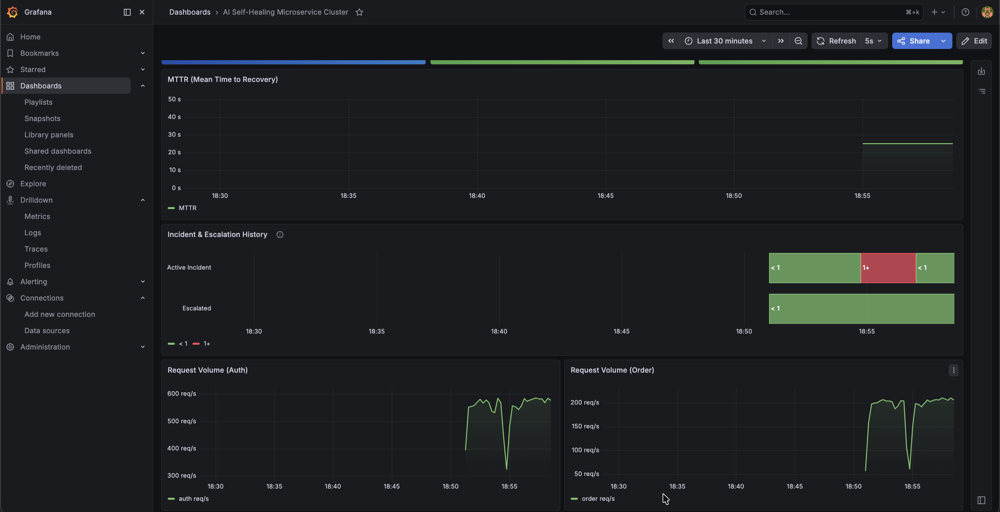

# ⚡ AI Self-Healing Microservice Cluster

An AI-powered autonomous system that detects latency anomalies in microservices using machine learning and self-heals in real time — without any human intervention.

---

## 🎯 What It Does

The system continuously monitors two microservices, learns their normal latency behaviour, and automatically detects and recovers from degradation events. When a fault is injected, the AI identifies the root cause, restarts the right container, and records how long recovery took — all within seconds.

---

## 🏗 Architecture

```
Control Panel (HTML/JS)
        │
        ▼
Control Server (FastAPI :7010)
        │
        ├──▶ Auth Service  (FastAPI :8001)
        └──▶ Order Service (FastAPI :8002)
                │
                ▼  (order calls auth on every request)
            Auth Service
                │
                ▼
          Prometheus (:9090)
                │
                ▼
        AI Orchestrator (FastAPI :8003)
                │
                ▼
         Docker Daemon  ←── restarts containers
```

**Service dependency model:** `order-service → auth-service`. Auth failures propagate upstream into order latency, which the root cause logic accounts for.

---

## 🧠 How the AI Works

### Phase 1 — Training (first 2 minutes)
The orchestrator collects `[auth_latency, order_latency]` sample vectors from Prometheus every 5 seconds. Samples containing NaN or Inf (no-traffic periods) are filtered out. Training requires at least 10 valid samples.

### Phase 2 — Detection (dual mechanism)
Every 5 seconds the orchestrator evaluates the current latency pair using **two independent detectors**. Either can trigger an incident:

| Detector | Method | Catches |
|---|---|---|
| **Primary** | Isolation Forest (`n_estimators=200`) | Combined multi-dimensional anomalies |
| **Secondary** | Per-feature z-score vs training baseline | Single-service spikes IsolationForest can miss |

### Phase 3 — Root Cause Inference
Z-scores are computed against the training mean/std for each service. Using the dependency model:
- Auth z-score elevated → restart `auth-service` (fixes both, since order depends on auth)
- Only order z-score elevated → restart `order-service` (independent fault)

### Phase 4 — Recovery & Escalation
- Container is restarted via the Docker SDK
- A 20-second stabilisation window follows each restart
- Max 3 restarts per 120-second window before escalation
- Escalation auto-resets when latency returns to baseline (no manual reset needed)
- MTTR recorded on every successful recovery

---

## 📁 Project Structure

```
AI-Self-Healing-Microservice-Cluster/
├── ai-orchestrator/          # ML anomaly detection + healing engine
│   ├── main.py
│   ├── Dockerfile
│   └── requirements.txt
├── services/
│   ├── auth-service/         # FastAPI auth service with fault injection
│   └── order-service/        # FastAPI order service (calls auth upstream)
├── control-server/           # REST API for dashboard ↔ services bridge
├── control-panel/
│   └── index.html            # Animated single-page dashboard
├── monitoring/
│   └── prometheus.yml        # Prometheus scrape config
├── tests/                    # Full pytest suite (60 tests)
│   ├── conftest.py
│   ├── test_orchestrator.py
│   ├── test_auth_service.py
│   └── test_order_service.py
├── grafana-dashboard.json    # Import this into Grafana
├── requirements-test.txt
├── docker-compose.yml
└── .github/workflows/ci.yml  # GitHub Actions CI
```

---

## ⚙️ Tech Stack

| Layer | Technology |
|---|---|
| Microservices | Python, FastAPI, Uvicorn |
| ML / Detection | scikit-learn (IsolationForest), NumPy, StandardScaler |
| Metrics | Prometheus, prometheus-client |
| Visualisation | Grafana, custom HTML/CSS/JS dashboard |
| Orchestration | Docker, Docker Compose, Docker SDK for Python |
| Testing | pytest, FastAPI TestClient (httpx), requests-mock |
| CI | GitHub Actions |

---

## 🚀 Getting Started

### Prerequisites
- Docker Desktop running
- Python 3.11+

### 1. Clone

```bash
git clone https://github.com/shourya-9/AI-Self-Healing-Microservice-Cluster.git
cd AI-Self-Healing-Microservice-Cluster
```

### 2. Start the microservice stack

```bash
docker compose up --build -d
```

This starts: `auth-service`, `order-service`, `ai-orchestrator`, `prometheus`, `grafana`.

### 3. Start the control server (locally)

```bash
cd control-server
python -m venv .venv && source .venv/bin/activate
pip install -r requirements.txt
uvicorn main:app --port 7010
```

### 4. Open the dashboard

Open `control-panel/index.html` directly in your browser.

### 5. Import the Grafana dashboard

1. Go to `http://localhost:3000` (admin / admin)
2. Dashboards → Import → Upload `grafana-dashboard.json`

---

## 🧪 Demo Workflow

1. **Start System** in the dashboard
2. **Enable Auth Traffic** and/or **Order Traffic**
3. Wait ~2 minutes for the model to train (`Model Ready` → green in Grafana)
4. **Enable Auth Latency** or **Order Latency** to inject a fault
5. Watch the Grafana latency panel spike, the Active Incident panel turn red, and the orchestrator restart the offending container
6. Latency drops, incident clears, MTTR is recorded

---

## 🧪 Running Tests

```bash
# Install test dependencies
python -m pip install -r requirements-test.txt \
    -r ai-orchestrator/requirements.txt \
    -r services/auth-service/requirements.txt \
    -r services/order-service/requirements.txt

# Run the full suite
python -m pytest tests/ -v
```

**60 tests** across 4 files covering:
- `test_orchestrator.py` — NaN filtering, z-score detection, root cause logic, training sample validation
- `test_auth_service.py` — all endpoints, crash mode, latency mode, toggle independence
- `test_order_service.py` — graceful auth degradation, env-driven URL, latency injection
- All tests run fully offline (no Docker required) using FastAPI's `TestClient`

---

## 📊 Grafana Dashboard

11 panels across 3 rows:

| Panel | Type | Shows |
|---|---|---|
| Auth Latency | Time series (threshold-coloured) | Green → yellow (>500ms) → red (>1.5s) |
| Order Latency | Time series (threshold-coloured) | Same thresholds |
| Model Ready | Stat | Ready / Training… |
| Active Incident | Stat | Healthy / Incident Detected (red background) |
| Escalation | Stat | OK / ESCALATED (red background) |
| Healing Attempts | Stat | Cumulative restart count |
| Healing Success | Stat | Cumulative successful recoveries |
| Healing Failures | Stat | Green when 0, red when ≥ 1 |
| MTTR | Time series | Recovery duration over time |
| Incident & Escalation History | State Timeline | Colour bands — green/red/orange per state |
| Request Volume | Time series | Auth + Order req/s |

---

## 🔑 Key Engineering Decisions

**Dual anomaly detection** — IsolationForest alone misses single-feature spikes when one service had constant traffic during training (the other feature is near-zero, making its variance very small). Z-score secondary detection catches these cases reliably.

**NaN-safe metrics** — Prometheus returns `NaN` for `0/0` rate queries (no traffic). Python's `nan or 0.0` evaluates to `nan` (nan is truthy), so all values are explicitly checked with `math.isfinite()` before use.

**Dependency-aware root cause** — Rather than generic "most anomalous service", the detector uses the known `order → auth` dependency: if auth is elevated, fixing auth also fixes order, so auth is always restarted first.

**Thread-safe state** — All shared globals (model, scalers, counters, flags) are protected with `threading.Lock()`. The monitoring loop runs in a daemon thread; the FastAPI app serves the status/metrics endpoints concurrently.

**Escalation auto-reset** — If latency is toggled off manually (without a container restart), the system returns to normal but `escalated=True` would otherwise persist forever. The monitoring loop detects `not is_anomaly and is_escalated` and resets automatically.

---

## 📈 Prometheus Metrics Exposed

| Metric | Type | Description |
|---|---|---|
| `healing_attempts_total` | Counter | Total restart attempts |
| `healing_success_total` | Counter | Successful recoveries |
| `healing_failures_total` | Counter | Escalation events |
| `healing_mttr_seconds` | Histogram | Time from incident start to recovery |
| `active_incident` | Gauge | 1 while an incident is active |
| `incident_escalated` | Gauge | 1 while in escalation state |
| `model_ready` | Gauge | 1 once the ML model is trained |
| `auth_request_latency_seconds` | Histogram | Auth service request latency |
| `auth_requests_total` | Counter | Auth service request count |
| `order_request_latency_seconds` | Histogram | Order service request latency |
| `order_requests_total` | Counter | Order service request count |

---

## 📸 Screenshots

### 🎛 Control Panel


### 📊 Grafana — Normal/Training State


### 🚨 Grafana — Incident Active and Healing Attempt


### 📉 Grafana — MTTR & History


### 🔍 Prometheus


---

## 🧠 Concepts Demonstrated

- AIOps / autonomous operations
- ML anomaly detection in production systems
- Observability-driven design (metrics → decisions)
- Dependency-aware root cause analysis
- Incident lifecycle management (detection → escalation → recovery → MTTR)
- Thread-safe concurrent Python services
- Container orchestration via Docker SDK
- Test-driven development with mocked infrastructure
- CI/CD with GitHub Actions
